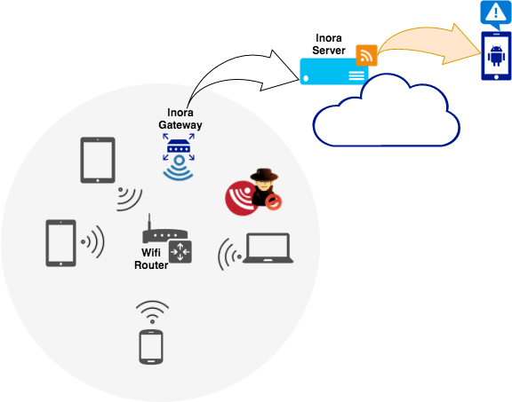

# Inora

This project allows to log the activity on a LAN, esecially connection/deconnection of devices on a Wifi Network. To achieve it, it won’t try to reach out to the the devices directly with tools such as ping, netcat or SNMP. Instead, it talks to the router directly.
This solution has few advantages :

&nbsp;&nbsp;&nbsp;<span style="color: green">✔</span> &nbsp;&nbsp;High level and relatively simple with scrapping or API calls depending on the router<br/>
&nbsp;&nbsp;&nbsp;<span style="color: green">✔</span> &nbsp;&nbsp;Detecting all devices (eg. Including the ones that don’t response to ping requests)<br/>
&nbsp;&nbsp;&nbsp;<span style="color: green">✔</span> &nbsp;&nbsp;Getting info on both 2.4GHz and 5Ghz if the router got several access points



## Project components

### The Server
It logs activity sent by the Gateway and exposes a RSS Feed with a secret URL. Subscribing to this feed allows to get notification of the activity on the LAN.

#### Running the Server

##### Prerequisites

- Having a web server installed such as Apache
- Configure the inora.conf file according to the environment

##### Setting up the init script
```sh
sudo cp inora/Server/init_script/inora /etc/init.d/inora
sudo cp inora/Server/init_script/inora.default /etc/default/inora
sudo chmod +x /etc/init.d/inora
sudo chmod +x /etc/default/inora
```
##### Starting the server

```sh
/etc/init.d/inora start
```

### The Gateway
It periodically queries the router and send the activity to the Inora Server.
Routers currently supported are :
- Livebox 2
- Bbox F@st3504

#### Prerequisites

- Configure the inora.conf file according to the environment

##### Setting up the init script

For Ubuntu :
```sh
sudo cp inora/Gateway/init_script/inora.ubuntu /etc/init.d/inora
sudo cp inora/Gateway/init_script/inora.default /etc/default/inora
sudo chmod +x /etc/init.d/inora
sudo chmod +x /etc/default/inora
```

For Openwrt :
```sh
sudo cp inora/Gateway/init_script/inora.openwrt/etc/init.d/inora
sudo cp inora/Gateway/init_script/inora.default /etc/default/inora
sudo chmod +x /etc/init.d/inora
sudo chmod +x /etc/default/inora
```

In both cases, update */etc/default/inora* to match with your environment.

##### Filtering and renaming devices

Use the devices.filter file to ignore some devices based on their MAC address. It allows to be notified of new connection only from new/suspicious devices.
This file can also be used to change the hostname a device appears with on the LAN.

Here is an example :

```
[filters]
D0-87-E2-07-38-BB! = tablet_foo
C8-BC-C8-D9-57-81 = myPhone
40-F3-08-87-48-7D! = myPhone
```

Devices with MAC address ending with a '!' are ignored. Other entries allow to rename a device based on its MAC address.

##### Starting the Gateway
```sh
/etc/init.d/inora start
```

## [Contribution](./doc/contribution.md)
